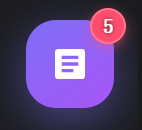
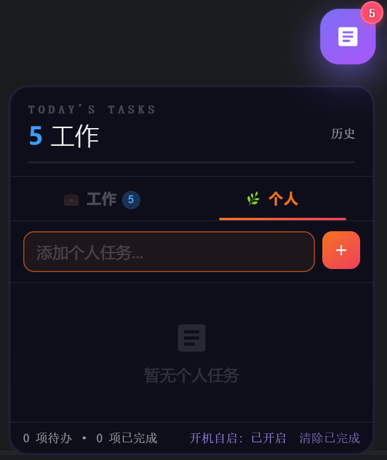
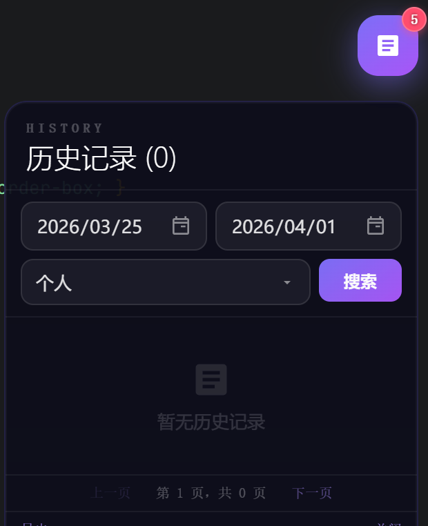

# desktop-todolist - 桌面悬浮待办清单

一款功能强大、界面美观的桌面悬浮待办清单工具，帮助您高效管理日常任务，提高工作和生活效率。

## ✨ 核心特性

- **桌面悬浮**：始终保持在桌面最上层，随时查看和管理任务
- **分类管理**：支持工作和个人任务分类，清晰组织不同类型的待办事项
- **任务拖拽**：支持手动拖动任务进行上下调整，灵活排序
- **历史记录**：自动保存完成的任务，支持按时间和分类筛选查询
- **数据导出**：支持将历史记录导出为文本文件，方便备份和分析
- **进度跟踪**：直观显示任务完成进度，激励您完成更多任务
- **开机自启**：支持设置开机自启，确保您不会遗漏任何重要任务
- **响应式设计**：适配不同屏幕分辨率，提供一致的用户体验

## 📸 产品截图

### 应用图标



应用的桌面图标，显示待办任务数量的角标。

### 主界面



主界面展示了任务分类标签、任务输入框和任务列表，右上角的历史按钮可快速访问历史记录。

### 历史记录界面



历史记录界面支持按日期范围和任务分类进行筛选，方便您查找和管理已完成的任务。

## 🚀 快速开始

### 方法一：直接使用（推荐）

1. 前往 [Release](https://github.com/xjyl2845613/desktop-todolist/releases) 页面下载最新版本
2. 解压下载的压缩包
3. 运行 `desktop-todolist.exe` 即可使用

### 方法二：从源码构建

```bash
# 克隆仓库
git clone https://github.com/xjyl2845613/desktop-todolist.git
cd desktop-todolist

# 安装依赖
npm install auto-launch

# 安装 Electron
npm install electron --ignore-scripts

# 运行应用
npm start

# 构建应用（可选）
npm run build
```

## 🎨 界面设计

- **深色主题**：采用深色背景设计，减少视觉疲劳，适合长时间使用
- **渐变效果**：使用渐变色按钮和元素，增强视觉层次感
- **响应式布局**：自动适配不同屏幕尺寸，提供最佳显示效果
- **流畅动画**：添加任务和完成任务时的动画效果，提升用户体验

## 💡 使用技巧

1. **快速添加任务**：在输入框中输入任务内容，按 Enter 键快速添加
2. **任务分类**：点击顶部的"工作"或"个人"标签切换任务分类
3. **标记完成**：点击任务左侧的复选框标记任务为已完成
4. **删除任务**：将鼠标悬停在任务上，点击出现的删除按钮
5. **调整顺序**：拖动任务可以手动调整其在列表中的位置
6. **查看历史**：点击右上角的"历史"按钮查看已完成的任务
7. **清除已完成**：点击底部的"清除已完成"按钮批量处理已完成的任务

## 📁 项目结构

```
desktop-todolist/
├── src/             # 源代码目录
│   ├── index.html   # 主界面
│   └── main.js      # 主进程
├── package.json     # 项目配置
└── README.md        # 项目说明
```

## 🔧 技术栈

- **前端**：HTML5, CSS3, JavaScript
- **桌面应用**：Electron
- **存储**：本地文件存储
- **UI 设计**：自定义 CSS，响应式布局

## 🙏 感谢

本项目基于 [Desktop-To-Do-List](https://github.com/Gitlovemore/Desktop-To-Do-List) 进行开发和优化，感谢原作者的贡献。

## 📄 许可证

MIT License

## 📞 联系方式

如有问题或建议，请在 [GitHub Issues](https://github.com/xjyl2845613/desktop-todolist/issues) 中提交，我们会尽快回复。

---

**desktop-todolist** - 让任务管理变得简单高效